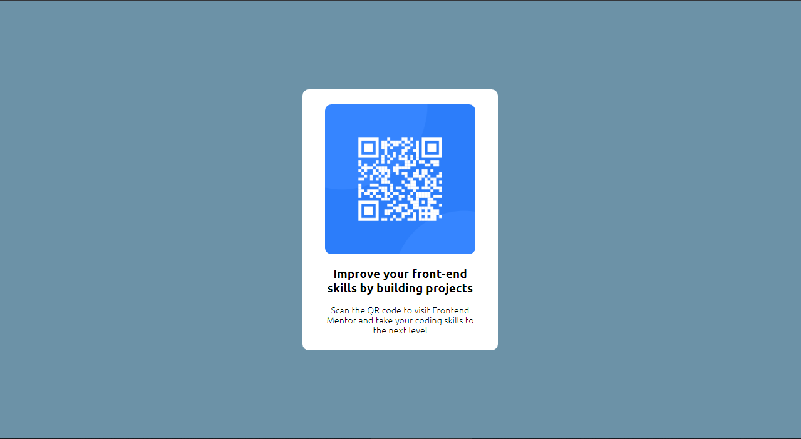

This is a solution to the QR code componet challenge on Frontend Mentor

OVERVIEW

***Screenshot***



***Links***

Solution URL [](https://ejercio-qr-fr-mentor.netlify.app/)

MY PROCESS

***Buit with***

-Semantic HTML5 markup
-CSS custom properties
-CSS Grid
-Mobile-first worflow

WHAT I LEARNED

In this project, I deepened my knowledge about the concept of  mobile-first with the correct use of media query

```css
@media (max-width: 650px){
    div.conteiner{
        margin-top: 10px;
    }
}
´´´

CONTINUED DEVELOPMENT

I want to continue deepening the realization of all kinds of frontend projects

AUTHOR

-Website- [Marcos Berta] (https://www.linkedin.com/in/marcos-berta-60a220225)
-Frontend Mentor -[mak2220](https://www.frontendmentor.io/profile/mak2220)